# UIUC生存指南  
ZJUI学生本科期间会在UIUC进行为期一到两学期的交换，但奈何学院刚刚诞生不久且在临行准备方面并不活跃，并没有人指导在UIUC具体的生存办法。这让同学们在赴UIUC交换前一学期忙碌课业的同时忧心忡忡，或来了UIUC以后才发现准备有遗漏，且给了一些不懂装懂的第三方（如奚爸）发挥的舞台。可谓是大本钟下送快递，上面开摆下面寄。  

我于2022年1月至2022年8月(更新：航班熔断了，9月才能回去🤡)于UIUC交换学习，对整个交换过程（除回国）有一些亲身的体会，争取用闲暇时间记录在此，为今后ZJUI同学们赴UIUC交换提供参考。  

同时，我个人的经历毕竟有限，我也希望这能够成为一个由ZJUI社区参与开发并维护的开源项目，欢迎在UIUC有过交换经历的同学一起贡献~  

## 重要声明
本库没有收取任何赞助，所有推荐没有任何广告成分，一切想法仅供参考。本库及相关资料贡献者们不为任何可能存在的错误的信息负责（本库涵盖面广、维护人员少且忙且不在UIUC常驻、消息源有限，难以对本库进行及时的更新）。

本库无偿开发，永远开源。暂无任何赞助途径。

## 相关资源
[一些健康证明&签证&选课信息](https://mp.weixin.qq.com/s/DqcPoObSXLDnZVCEJxlh-g) 

[部分租房信息](https://mp.weixin.qq.com/s/EjE0sXPBKt4mQ5G81otMGg)

## How to contribute  
fork并添加自己的想法后提交pull request即可，我会时常关注本库。 

如果撰写内容需要其他人的帮助来填坑，请用“蹲”字标注出来。有热心填坑的朋友可以直接搜索“蹲”看看有没有能填的。

## UIUC地图（单击查看清晰大图）

大部分的活动范围会在Illini Union Bookstore以北，E University Ave以南，ICON Apartments以东， Campus Circle以西区域内。

## 来UIUC前  

### 机票 + 出发时注意事项   
可选航空公司（排名无先后）： [中国国际航空](https://www.airchina.com.cn/)，[美国联合航空](https://www.united.com/zh-hans/cn/)，[加拿大航空](https://www.aircanada.com/ca/zh/aco/home.html)，[中国南方航空](https://www.csair.com/cn/)，[汉莎航空](https://www.lufthansa.com/cn/zh/homepage)，[国泰航空](https://www.cathaypacific.com/cx/zh_HK.html)，[厦门航空](https://www.xiamenair.com/zh-cn/)  

2022年1月时，各大航空公司基本都需要临行前24小时的核酸检测阴性证明，可以到海宁市人民医院进行检测，上午检测下午（6小时到8小时左右）就能出结果。学校位置比较偏不好打车，建议提前约车。  

在预订机票时记得咨询航空公司相应航班是不是行李直挂（行李办理完托运直接到目的地，中转时不需要自己重新拿行李办托运手续）。建议选择行李直挂的航班（中转办托运据说需要2小时以上，请注意中转所需时间）。  

对于订票人数比较多的航班，可以询问学院能否统一安排车辆前往机场（我认为要求学院安排并不过分，毕竟是年级规模的交换）。一般的巴士行李区并不能容纳每个乘客两个行李箱，提醒学院计算位置时考虑行李区放不下的行李。 

准备行李时，一般会准备一个书包+两个行李箱（两大托运或一大托运一小登机）。国际航班的登机箱尺寸会比国内航班的尺寸小一点，笔者当时带的登机箱（国内的航班一直可以上飞机）在浦东机场因为太大被要求托运。  

香槟冬天温度可以达到-10摄氏度左右，夏季温度可以达到35摄氏度，可以针对抵达季节带衣服，来美国后再网购，不用把整个衣柜搬过来。  

在向行李箱中塞入药物或食物时，建议查一下是否允许入境。任何肉类食品都不要带，否则有遣返风险。药物比较玄学，含有敏感成分的药品尽量不要带，美国药房里发烧感冒头疼之类的非处方药物都可以购买。   

出发之前建议在电子设备以及行李箱上贴一些标识（贴纸），防止行李箱混淆。另外入境时会有安检（具体在“海关”部分说明），如果你的macbook和别人的都长一个样，那么过完x-ray就不知道哪台是谁的了（人和行李会分开检查）。

国际航空登机手续很麻烦，需要预留三小时以上的时间。大概流程是找值机柜台，办理托运，扫二维码填写出境健康声明，过边检，过安检，等飞机，登机。证件至少需要核酸检测证明、翻译后的新冠疫苗接种证明（具体在“疫苗”部分说明）、DS2019、护照。(2022.8更新:有些航空公司对疫情防控要求降低了，这里仅供参考)

大多中美航线的飞机上是有wifi的（当然是有偿使用的）。电源的话，根据飞机型号的不同，可能需要转换器（有些飞机用的美国标准110V电压，我们220V电压充电的设备充电口会不太一样）。

最后滴最后，趁着还在国内，珍惜那些来了美国就见不到了的东西（如食堂一楼的红豆双皮奶）吧！

### 签证  
写这个太麻烦了，我先摆着

### 租房
不会有人还有半个月就来UIUC了还没租房子吧，暂不开发，先摆着

### 信用卡&消费准备&消费文化差异
美国消费方式还停留在pos机的阶段，并没有任何一家公司实现了诸如wx或zfb的移动支付“大一统”。  

来美国之前需要做的与消费有关的最重要的事情有：办理一张visa信用卡，以及到银行兑换一些美元现金。在美国的每一笔消费小票会告诉你交了多少税（Illinois一般11%左右），使用现金在餐厅支付不用交税。至于换多少现金的问题，我个人来美之前换了1000，从一月到五月大概花了不到200。基本都是用信用卡支付的。另外大多app（比如amazon，uber）都可以绑定信用卡消费。visa信用卡还款可以用美元也可以用人民币（不过汇率天天在变）。

visa信用卡有很多，我自己办理的是中国银行的子母卡，还款会比较方便（不过每一笔消费爹妈都会看到hhhh，也算是随时报平安）。而且考虑到其他银行在美国可能没有分行，如果信用卡遗失比较麻烦。大额消费有时会让输入PIN码，但我们往往不知道自己曾经设置过。格局打开，如果试了半天没试出来，不妨直接空着并点击next（空PIN也是PIN）。信用卡会有限额，这个要在出国之前设置好。请确保第一个月有5000刀的额度，以及接下来每个月有2500刀以上的额度。额度实在不够的话，信用卡是可以存美金消费的（至少我的可以）。超过信用额度的大额支出（比如回国机票）可以通过提前买美元汇入信用卡内支付。

在餐厅吃饭时，如果服务生将菜给你端上来，你理应支付小费。一般在10%到20%。也有很多餐厅是做好吃的让你自己去取的，这种就不需要给小费。很多餐厅会要求顾客就餐完毕后将餐盘端到指定的地方后，或者将一次性餐盒扔到垃圾桶后再离开。不过去快餐店，乘坐uber的时候，小费一般是可给可不给的。

很多超市（比如Target）会有自助收银。挑完要买的东西后可以去人工收银（可能要等待，且人工收银一般两个塑料袋装得下的东西给你装四个袋子），也可以选择自助。自助收银只需将每个商品的条形码扫一下，都扫完以后支付即可。扫重复了可以叫店员帮忙恢复一下。但我时常怀疑如果我少扫了或者扫错了也一样可以装进袋子拎走。  

美国满21岁才允许购买含酒精的饮品。如果需要购买酒类，需要带上护照或者其他出生年月证明。  

美国有些东西莫名其妙的贵，不过科技产品都相对便宜一点。国内4000块的显示屏400刀就能买到，但很多tb上九块九包邮的这边能收二十刀并且加收运费。比如Campus Circle隔壁自行车店那种国内2000rmb能买到的自行车要800刀，bookstore一个小鼠标垫卖19.9刀，非常离谱。来交换的话预计每月消费应该在房租800+饮食900+其他购物消费300 = 2000左右（单位：美元）。如果你是富二代请无视这个数字，花就完了。  

### 疫苗
这里疫苗主要是有两个目的：第一是登机时需要covid-19疫苗的接种证明翻译件，第二就是UIUC对于免疫接种的要求。

当时我去的地方是浙江国际旅行卫生保健中心，位于杭州文三路沈塘桥地铁站南200米左右。杭海城际还挺方便，挑了个周五当天去当天回的。  

材料的话，至少需要：  
1. （身份证+护照） 的 （原件+复印件）  
2. UIUC官网上下载的疫苗表。不需要提前填写。大概长这样：[immunization.pdf](file/Immunization%20History-601-with%20Upload-fillable.pdf)
3. 新冠疫苗的接种记录及复印件（海宁接种的话会有一个小纸条接种记录）
4. 小时候的疫苗接种本+复印件（这个不同地方的不一样）
5. financial support复印件
6. 2寸照片

疫苗表由工作人员填好以后记得去McKinley网站上传一下: https://illinois.medicatconnect.com/docupload.aspx

另外就是，如果疫苗有货的话，可以补打一下UIUC要求的疫苗。国内大多数地方都差一到两针麻腮风以及百白破。当然也可以选择来UIUC白嫖医疗保险。具体会在“初到UIUC：TD Test + 接种疫苗”部分说明。

宁波也有一个可以办理国际卫生手续的地方。蹲一个宁波朋友填坑。

### 海关
就我自己过美国海关的经历而言，我感觉只要不碰这边的红线（别带不让带的，别说不该说的），问题都不大。

我当时是在加拿大温哥华转机的时候办理的入境。经过了二十小时的漫长飞行，下飞机后寻找USA方向的标示，抵达美国入境安检点。入境安检主要是检查是否带了一些允许出中国国境但是禁止入美国国境的东西。入境安检还是比较严格的，会要求倒掉水杯里的液体，将行李中的所有电子产品拿出来放到筐里，并把书包也放筐里，统一过X-ray。一般人是会比筐晚出安检的（这时候贴纸就很重要了，毕竟大家的电脑很多都长一个样子，说不定前面的人就把你的电脑错拿走了）。另外就是入境安检需要shoes off并放到另一个筐里。美国这个入境安检给我的感觉就是非常混乱。人很多但是通道很少，安检区占地面积也很小。我当时电子产品很多，electronic devices + bag + shoes总共好像用了四个筐才把东西全部放下，幸好并没有跟谁的混淆。

安检X-ray的传送带很神奇，会自动将疑似有问题的筐筐移到另一个轨道上（总共两个轨道，其中一个是没问题的，人过了安检就可以领，另一个是疑似有问题的）。如果你的行李不幸进入了有问题的传送带，不用惊慌，会有工作人员给你检查到底是哪一件行李有问题并告诉你。有时候可能只是它设备检测的太严格。我当时有一个筐筐上了有问题的传送带，但是工作人员检查完以后表示没有问题，没有扣留我任何行李就放我走了。我旁边的哥们确实被检查出了不让带的东西（好像是一瓶液体），他直接表示不要了，然后安检员把那瓶液体扔了以后面带笑容对他说"So they(出境机构) actually let this go(出境)?"就放他过了。

安检结束以后会进入另一个大厅的入口。这个环节主要是检查托运行李的。从下飞机开始美国海关就在处理并检查你的托运行李了。你需要拿着你的护照让工作人员扫一下，如果行李已经被处理并且没有问题，工作人员会让你进入大厅，如果还没有被处理到就要在大厅入口附近排队，等待下一轮扫护照，直到行李被处理且没有问题。

随后会进入大厅等待，我也不确定时在等什么，但大概同样是等待行李被处理（可能是行李也有入境手续？）。那个大厅会有一个电子告示板，当你的名字出现在告示板上时，就说明你的行李已经完全处理完毕，可以进入下一个区域办理入境手续了。所以总结起来，你的托运行李需要等待两次处理（具体是什么样的处理我并不清楚）才能入境。

“小黑屋”是在这个时候发挥用处的。进小黑屋这个事情可能就是随机抽取的。我本人并没有进小黑屋。如果有进过小黑屋且愿意分享的朋友，可以填一下这个坑。

行李被处理好之后就是最后一个入境区域了。这里有点类似收费站，会有海关官员坐在玻璃屋里问你问题。基本上就是排队+等有人叫你到对应的玻璃屋前，然后问你啥就说啥，要你啥就给啥，不问就别说，不要别给。基本上就是要一下DS2019和护照，然后问你几个问题（我当时被问的是：来的目的（交换），在什么地方（UIUC，一定记得全称是University of Illinois (at可以有也可以没有） Urbana Champaign），住哪里（学校旁边的apartment））然后就过了。

整完这一些大概总共需要一到两小时，我当时以为只是加拿大的入境手续，还奇怪怎么这么麻烦，直到我过了玻璃屋以后看到"Welcome to the USA"和🇺🇸，才知道自己已经入境自由美利坚了。。。

直接在美国本土（旧金山可能比较多）入境的话。。。据说是“在浑然不觉的情况下就入了境”。~~蹲一个从美国本土入境的朋友填坑。~~

美国入境的同学来填坑了。美国本土入境相当方便，不过这个可能和我所做的卡塔尔航班有关。一下飞机就来到了一个很长的队伍排队，排到你了就会被问几个问题，和签证问的问题差不多。问完问题后就过关了，取了行李就可以直接取住宿的地方，整个过程快的话二三十分钟。

### Chicago->UIUC  
从芝加哥奥黑尔机场到香槟UIUC还有一段很漫长的距离，19级当时进行了包车（也方便放行李）。另外就是机场其实是有大巴直达香槟的，如果没有包车选项可以考虑一下。然鹅我并不知道大巴怎么预定。 蹲一个有经验的同学完善一下这里。  

其他办法的话其实不太推荐了（毕竟要带着很多行李）。芝加哥的Union Station有火车可以到达香槟，另外就是一些公司会运营芝加哥到香槟的公交线路。具体线路可以在Google Map上搜索。机场到Union Station直线距离其实都已经有20公里了。具体可见下图。  

### 必备app
科学上网/梯子 + 回国加速器: 国内有个大防火墙，境外的网络都访问不了，在来之前安装软件用国内的网络是搜都搜不到的，需要翻墙。然后到国外以后，如果想打国服游戏或者追剧，延迟会很高或者收到地域限制（“此内容你所在的地区已下架”）。为了避免这些情况建议整个回国加速器。我个人翻国内的墙用的是Hammer VPN（现在好像叫AnyCast了）以及ClashX（这个vpn不太好配置），回国加速器用的是Malus。Malus开启以后王者可以到200ms以内（虽然感觉这个延迟还是玩不了就是说）。

Google Chrome浏览器 + Google搜索引擎。美国这边搜索引擎用的大多是google或者microsoft的。百度上基本啥都搜不到。

Google Play。谷歌应用商店。国外用的app一般国内手机自带的商店是没有的。

Amazon在线购物。不解释。另外可以整一个walmart（沃尔玛）。香槟有一个walmart但是离得很远。app里点单一般第二天晚上就可以送到学校附近。

Uber。打车用的。香槟这边感觉司机挺少，并且大多都朝十晚五。。。。不过多等一会儿还是会有司机接单的。

Google Map. 谷歌地图。不解释。

Uber Eats + 熊猫外卖(Hungry Panda) + Chowbus。外卖三连。

百事AA记账（BestTracker)。出来以后消费都挺高的，很多时候是一个人买单回头再算钱。整个记账软件可以避免很多麻烦和纠纷。

PNC bank或者别的境外银行。来uiuc一般会在校内的PNC银行办一张银行卡（别的银行也有，比如chase）。用PNC自带的Zelle给朋友转账还是很方便的（有点类似支付宝转账）。

伊利诺伊app。UIUC官方app。主要用来出示通行码以及巴士通票。

国货严选据说可以在海外买到一些国内的产品。这个我下载了但没有试过。不知道香槟这个比较偏的地方能不能送到。

UIUC bus或者Illini Bus。查公交车到站信息的。UIUC这边没地铁。平时坐公交车挺方便（Campus Circle有一班公交车可以直达绿街，每20分钟一班）。

苹果用户可能要转区（从国区转到美区）才能在app store里下载一些软件。转区有个要求就是账户里没钱。所以如果想要转区可以提前想一下怎么把apple账户里的钱花完。我个人没有转区。

## 初到UIUC

### 手机卡&网络
稳定快速的网络还是十分重要的。国内的运营商会有国际漫游服务，价格高且流量不太够用，but这大概是飞机在美国落地之前的唯一选择。个人推荐是来之前办理一个国际漫游的套餐。联通收费是每月40元，有2G流量。境外流量包也建议买一些。

拥有一张美国本土手机卡的必要性大可不必多说。中国大陆只有三家移动运营商，即移动、联通、电信（排名无先后）。然鹅，考虑到美国是一个信仰自由与市场竞争的国度，其拥有大约200家移动运营商这种事实是可以接受的。不过用户最多的也就是四家：AT&T、Verizon、T Mobile以及Sprint。

至于具体的选择，抛开香槟不谈的话，可以参考这篇文章: [To知乎](https://zhuanlan.zhihu.com/p/28740648)

如果是在UIUC的话，我所了解的大多同学在这四家之中会选择AT&T或T-Mobile。我个人选择了AT&T.然鹅AT&T的价格有些令人难以接受（折算成人民币含税可达每月500元），所以会有一些同学选择比较省钱的[MintMobile](https://www.mintmobile.com/)。

AT&T贵有贵的道理。其套餐一般拥有无限流量+无限时长通话。然鹅AT&T最差的套餐就是这个无限流量+无线通话（不给韭菜选择权），稍好一丢丢的（每月加5刀）可以开热点（没错，热点功能单独计费）。需要去AT&T营业厅办理（香槟有至少三家营业厅），可以自己选择手机号（工作人员会帮你摇一些号出来，在之中做选择，如果觉得都不咋地可以重新摇）。我所办的套餐每月含税75刀，不过我听说有税前30刀的套餐(不确定是不是att的)，蹲个好心人透露一下吧。

~~T Mobile据说便宜一些，每个月只需40刀左右？蹲个T Mobile用户填一下这里。~~Tmobile选手来了。Tmobile的话有三个档次可以选，分别是10Gb一个月，无限流量一个月，无限流量+无限热点一个月。如果是individual plan的话价格和AT&T类似，但是选择family plan的话会便宜很多，最后我选的中等档次的family plan每个月是35刀左右（四个人拼）。

MintMobile一般是每月4GB流量+无限通话（貌似税前只需15刀每月），当然也有进阶套餐（流量多点，价格贵点）。貌似需要网上提前订购，手机号完全是随机摇的，快递到买家给的地址（也就是说，在入住之前只能快递给在UIUC且认识的人手里，除非你可以忍受龟速快递，以及来美国第一个星期都没有手机卡）。ZJUI是有很多毕业生在UIUC继续深造的，如果选择mintmobile的话来之前可以联系一下帮忙收一下手机卡。

办理手机卡还需要注意的一点是，要确认自己的手机型号以及频段可以使用所办的手机卡。如果不匹配还是很头疼的（我的OnePlusRT9就无法使用MintMobile的卡）。以打算办理AT&T为例，来之前务必谷歌搜一下"AT&T IMEI check"或者"AT&T compatible check"，输入手机的IMEI码(International Mobile Equipment Identity，每个手机会有至少一个unique IMEI，至于怎么查不同的手机不一样，不过都是在类似关于本机->状态信息的地方可以看到)。如果各种不兼容，建议换一部手机。

最理想的状态就是，所使用的手机可以放两张卡（国内手机现在都这样），一张国内的一张美国的。然鹅美国的手机大多只有一个卡槽，如果想用第二张卡需要办电子手机卡（好像叫e SIM card），然后扫个码扫进手机里（我也不知道这到底是怎么实现的）。而小米手机正好就可以满足这个理想的状态，最新款的商务机在美国只需要300刀左右，而且是unlock过后的新机，我看我舍友用起来也十分顺畅，吊打同价位的三星等安卓手机。所以，如果是比较节俭同时很爱国的同学，小米简直是不二之选。

由于我个人将来大概率来美继续深造，所以直接在AT&T买了一部新的iphone（相比国内便宜了一千多rmb），把e SIM card扫进去了。然鹅把国内的手机卡放进这个iphone并使用又是一番曲折，可以多说几句。在AT&T store买之前一定要确认是不是合约机（合约机会lock其他运营商知道合约结束，这时候国内的卡放进去不work很头疼）。即使不是合约机，买完以后还是查一下系统信息是不是还是lock的状态，如果是则需要让店员帮忙解一下，否则国内的手机卡是使用不了的。

iphone的价格是随时在波动的，在20届去交换的时候，iphone的价格已经和国内差不多甚至比国内贵了，甚至很多iphone11 12翻新机都在四百到五百美刀。

UIUC校内建筑几乎是网络全覆盖的。有两个网络IllisNet和Eduroam可以使用，用uiuc id（邮箱）登录即可。然鹅绿街上是没有网络覆盖的，如若上网只能使用流量或者餐厅的wifi。

All set！ 请享受自由的网络吧！But，as a reminder，警惕境外谣言。面对境外反华势力的意识形态攻心战，心智尚未成熟的年轻人要培养正确的历史观，多学习中国历史，特别是中国共产党党史、新中国史、改革开放史、社会主义发展史，明白现行制度的革命历程、中国人民艰难创业和党为人民服务的初心使命；还要培养多读书、多讨论的习惯，多学习正面典型，遇到反面事例多思考，向有关专业人士请教，查找法律、政策、建议的规范文本，不以片段言论武断地判断问题，不把知识建立在谣言、传闻的基础上。

以上文字是复制的。我不是粉红，也不是50万。我相信自由的网络并不代表正确的信息，望各位接收到任何关于我国的说法时多思考几下“这真的是对的吗？其逻辑合理吗？其证据可靠吗？”，无论此说法来自国内还是国外。

### 华为用户指引
如果手机是华为的同学，又不想换新手机，有两种选择。第一个是手机上下载一个Gspace，相当于一个google的模拟器，在Gspace里面就可以下各种Google Play里面的app了。第二种选择是安装一个google框架，详细指导见https://www.youtube.com/watch?v=GlZzpMdr2QY。这两种方法都不太稳定，比如下载好的Google map定位不准，不会显示方向，比如Uber打开不了。当然也有华为手机可以在美国如鱼得水，我愿称之为鸿蒙玄学。

### 学生卡
UIUC这个学生卡其实我办了也没怎么用到过，不过还是说一下大概的办理流程。首先确认此次交换报道是线上报道（check-in）还说线下报道。如果是线下报道请无视本节。

学生卡在大多数时候可以起到代替护照的作用（仅限香槟），取打疫苗，坐公交，进学校大楼，或者出示身份证明的时候都可以用学生卡。

线上报道的话，UIUC会邮件发你check-in用的网站，然后把该填的信息填好，扫描并上传护照与签证页（好像是），然后会有一个上传照片的地方，在此处上传的照片会被印在你的学生卡上。

等大概半天时间会通过你的check-in，之后去bookstore（下图）办理学生卡。第一次办理是免费的，丢卡后补卡需要20刀，但据说如果直接把卡掰断然后说卡坏了可以免费新办一个（笑嘻）。

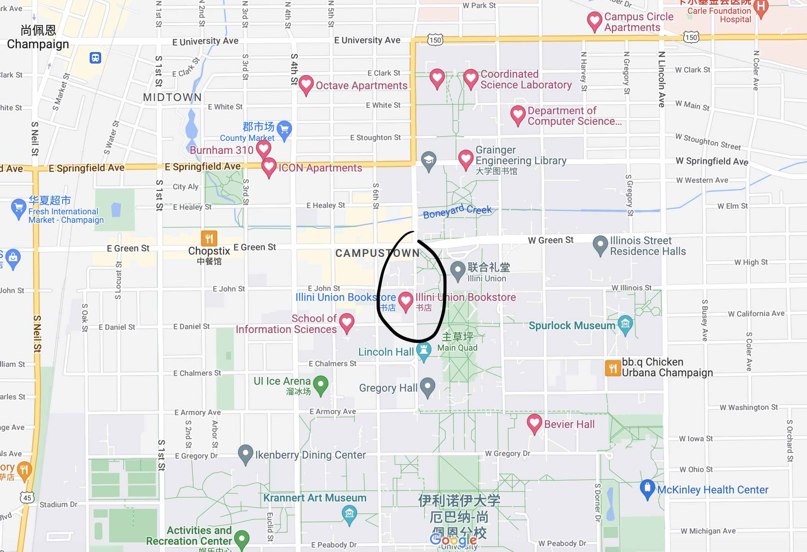

### 银行卡
同样是在bookstore内有一家PNC银行（PNC bank）。在PNC开户需要填很多信息，会有工作人员告诉你要填哪些东西（可能有会说中文的工作人员）。填完后卡会以邮寄方式在五个工作日内寄到你的填的信箱地址。如果收不到的话可以直接再去PNC一趟，工作人员可以现场给你制作一个（所以我其实不太明白邮寄的意义何在）。

PNC会给你一个人开一张储蓄卡与三个账号：一个用来短期消费使用，一个用来存小钱（比如准备交学费之类的），一个用来存很多钱（买理财吧可能）。在交换时期用得到的其实也就一个短期消费的账户。国内的卡买美元以后是可以直接把美元转到PNC卡上消费的，每天的限额是1000刀。

PNC有两个挺方便的功能：在线转账和在线支付。

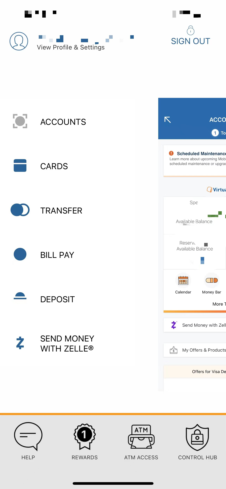

这个Zelle是一个通过手机号就可以在线转账的东西，朋友之间转美元很方便。

在线支付可以在card里使用

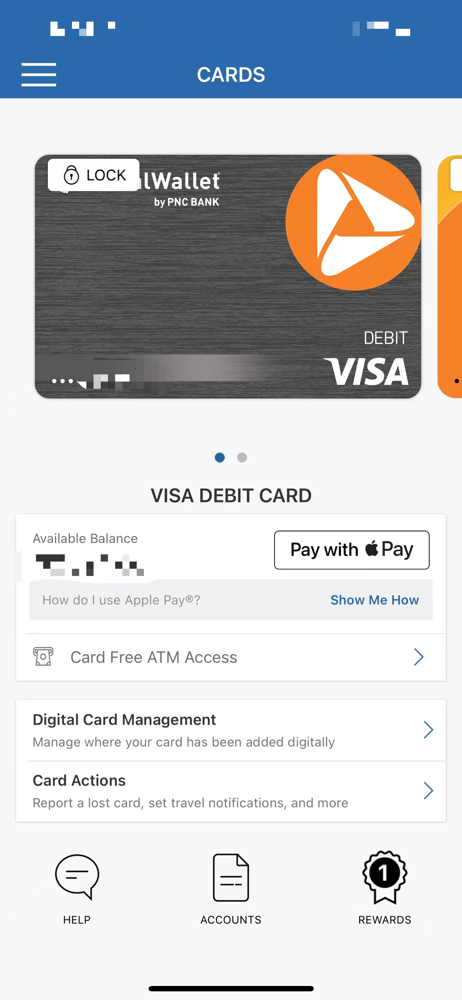

我用的是🍎手机。到这个页面之后点Pay with 🍎 Pay就可以把手机当信用卡刷了。非常的好用。

### 核酸检测
美国目前所使用的的核酸检测方法还是挺怪的（唾液检测）。核酸检测的目的主要有两个，一看自己是不是阳了，二是获得building access。

building access是在uiuc的官方软件Illinois里可以看到的，进学校很多建筑的时候会有类似志愿者的查building access，不过有时候没有志愿者也可以随便进。

**2022.8更新**：Building Access Status will **no longer** be active for the Fall 2022 semester in the Illinois app or the Boarding Pass. You should not ask anyone to prove their vaccination or testing status.

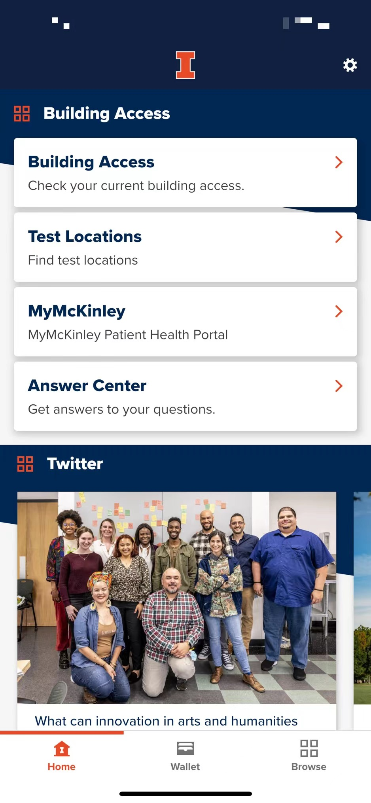

测试点在Test Location里查看，一般是下午5点下班。Illini Union的检测点大概是最热闹的，NCSA附近也有一个检测点。

检测时需要先跟工作人员登记或确认一下个人信息（姓名、生日、电话号码之类的），然后会问你要漏斗(funnel)还是要吸管，个人觉得漏斗比较好用。之后会给你个很小的容器（目测5mL），之后尽最大努力分泌唾液且设法移入容器，放到出口的工作人员处即可。一般12小时左右出报告。在[McKinley](https://mymckinley.illinois.edu/)看结果。

一次building access会持续到检测阳性或者长假期结束（春秋假、寒暑假）。我的评价是新冠在美国就是流行性感冒罢了(omicron的毒性其实也并不强)。更多详见“其他热议话题”里的Covid-19部分。

### 购买必需品
UIUC的公寓入住的时候基本就只有一张桌子，一张床，一个床头柜，连个台灯都没有，浴室也没有灯泡，很多东西都需要买。如果不差钱的话绿街上的Target可以买到大多数需要的东西。我个人还是更推荐去香槟西北角的Walmart（听说最近几年在Urbana也会开一个Walmart）。打个Uber来回大概20刀左右，应该远低于Walmart物价低省下的钱。Walmart商场很大，东西挺全，灯光、卧具、应急药品、洗护用品、食材、平价衣服、厨具应有尽有，足够刚来前几天生存。

Walmart有手机app，可以网上订单，基本上是第二天或者第三天晚上送达，且用UIUC大学邮箱注册可以免费试用一个月会员免配送费。如果住4B，跟室友分开时间订阅是可以白嫖一个学期会员的。

### 购买食材
虽然沃尔玛确实能买到很多食材，但实在是太远了，总感觉特别麻烦。相对近一些的有郡市场County Market（icon旁边），远东超市（ovtave附近）。Target里没什么食材，但有非常多放到微波炉或烤箱里处理一下就能吃的东西，比如速冻披萨。

虽然平日里可以在绿街上就餐，但冬天一定要保证冰箱里有够3天的食材，因为暴风雪随时可能来临，届时餐厅大多会关闭，且出门会非常困难。暴风雪前如果发现没吃的了要赶紧去买，要不然就是排长队+买不到想买的。

### 做点吃的
https://github.com/Anduin2017/HowToCook  

### 一些奇怪的USA家具使用方法
美国的一些家具对于中国游客确实不太友好，比如：

美国的微波炉功率很大（比海宁宿舍里的大很多），按照海宁寝室的时长微波肯定糊透了。一般可微波的食物包装袋上会标注微波多久。

美国的烤箱有些用摄氏度，有些用华氏度，具体还得自己判断（0摄氏度 = 32华氏度，100摄氏度 = 212华氏度）。

美国的花洒只有一个旋转维度，随着旋转呈现 小量冷水 - 大量冷水 - 大量热水。

美国的窗帘很玄学，能用两根绳子控制一切。。。升降靠上下拽，卡住或松开靠左右摆，我到现在也不知道是个什么原理。。。各位来了自己体会吧。

美国大多数公寓没有海宁寝室方便的直饮水/开水，需要买净水壶或热水壶。据说厨房用水是经过净化符合饮用标准，但我个人不让水龙头里直接出来的水过一下净水壶是真不敢喝。

美国有些公寓是不管你照明的（比如Campus Circle）。公寓只管通电，灯泡需要自己装。刚到第一天无法开灯不用惊慌，便利店一般都有卖灯泡。

UIUC学校里倒是有很多接水的地方，且有出水口允许没有接水容器的人直接凑近喝（虽然我一直接受不了）。如下图。每天从学校回寝室之前可以白嫖一杯再回。

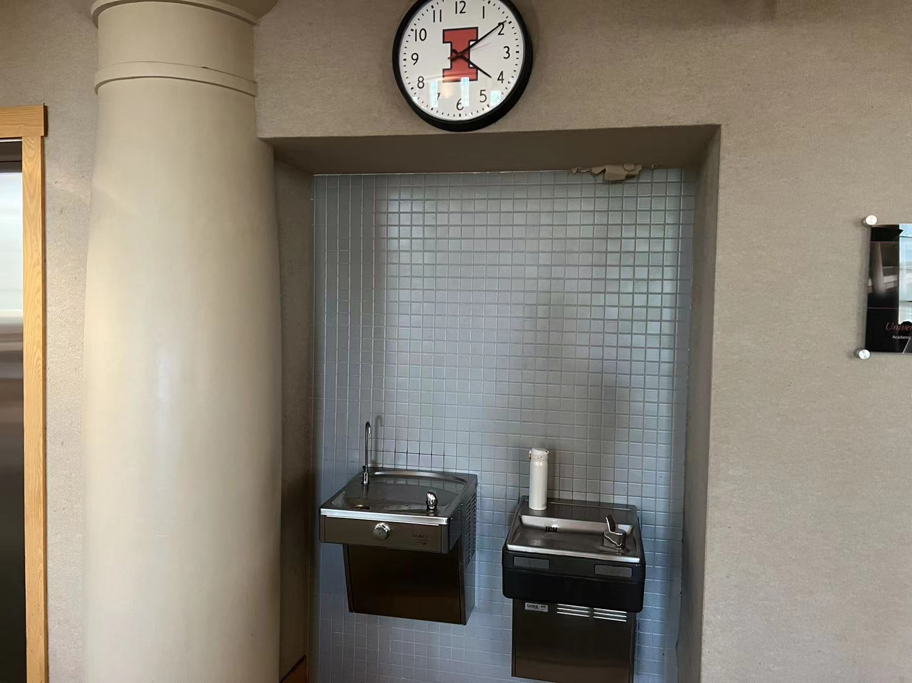

### TB Test + 接种疫苗
先放一些网站链接：

McKinley Health Center: https://mymckinley.illinois.edu/

CVS Pharmacy: https://www.cvs.com/pharmacy/v2/#/pharmacy

Walgreens: https://www.walgreens.com/

注射新冠疫苗(辉瑞或莫德纳)可以在CVS，Walgreen或者Mckinley预约，绿街上就有一家Walgreens。但是这家Walgreens里面没有Pharmacy，不能打疫苗。去上面的链接里找Covid-19 Vaccination预约。有的时候官网的疫苗信息和实体商店里面的信息是不同步的，在去之前需要打电话和店员确认一下是否有足够的疫苗供应。

TB Test以及其他杂七杂八的UIUC要求注射的疫苗都可以在McKinley Health Center解决：

这里需要注意的是，新冠疫苗是免费的，不需要医保，而TB test和其他疫苗都需要医保，只要在你医保生效后才可以做。

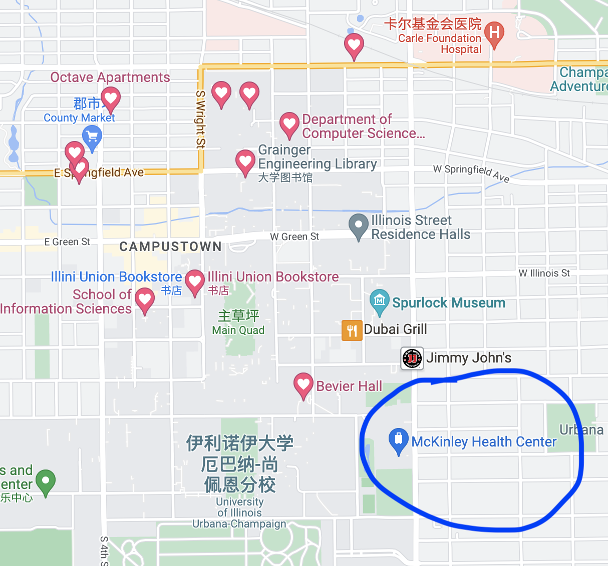

**如果不按时完成TB Test以及疫苗注射，UIUC会在开学三星期左右锁掉你的选课系统**

比较困难的一点是，TB Test和UIUC要求的疫苗都要通过打电话给McKinley预约: (217) 333-2702 (2022年春学期曾经是这个号码)。大概会索要你的姓名，UIN，生日来核对你是本人预约。如果是打疫苗预约，具体要打什么疫苗是不需要说明的，到了预约日当天McKinley的工作人员会根据你之前上传的疫苗表确定你当天要注射的疫苗，并告知你每种疫苗下一针何时接种。刚到UIUC基本上每个月都得去一趟McKinley。你也可以在工作人员选疫苗的时候提出自己的疫苗需求，比如HPV疫苗。

**报销流程**

打完疫苗后工作人员会给你一个小卡片告诉你如何通过学生医疗保险报销（确实挺贵的，但是保险应该更贵）。

先去McKinley网站上"$Bill Stat & Event Confirm"这里找到希望报销的疫苗的Statement，然后去医疗保险网站: https://www.uhcsr.com/ (UIUC2022年春学期曾用)

登陆进去以后大概长这样:

点进去以后填好报销信息，在UPLOAD DOCUMENT这里上传McKinley网上的Statement，提交即可。**交之前要确认一下MyProfile->Personal Info里的"US Mailing Address"是你自己的信箱地址**。McKinley声称会在几个星期后以支票形式送到你的信箱里。我自己因为地址填错了血亏500多刀😭。

## 活在UIUC（并且争取活得滋润）

### 餐厅（排名无先后）
我去过的中餐厅（除了panda express都能用中文点餐）：

蒲月巷 Mid Summer Lounge（绿街上，面食）

老四川 Lao Sze Chuan（latitude楼下，川菜）

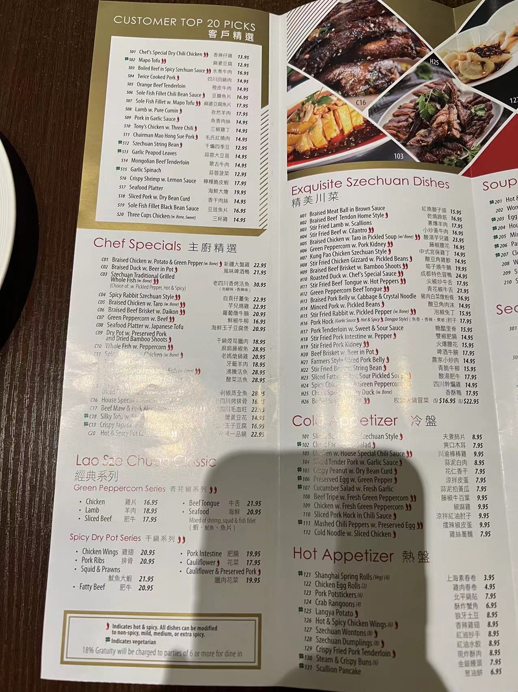
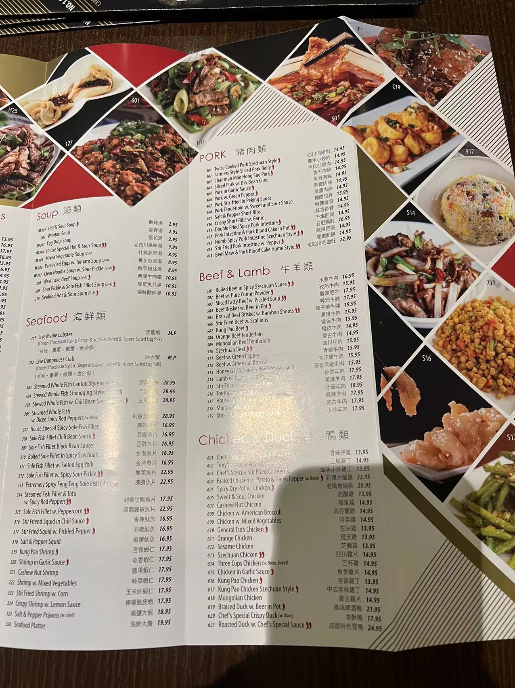
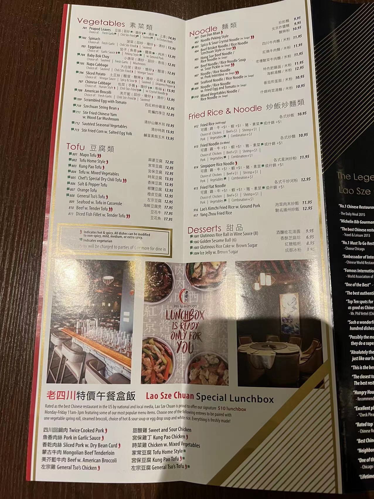

万家香 Cravings （绿街北，🍚，价格比较实惠）

麦香村 Golden Wheat（绿街上，面食）

麻辣烫 Spicy Tang（绿街北，店如其名）

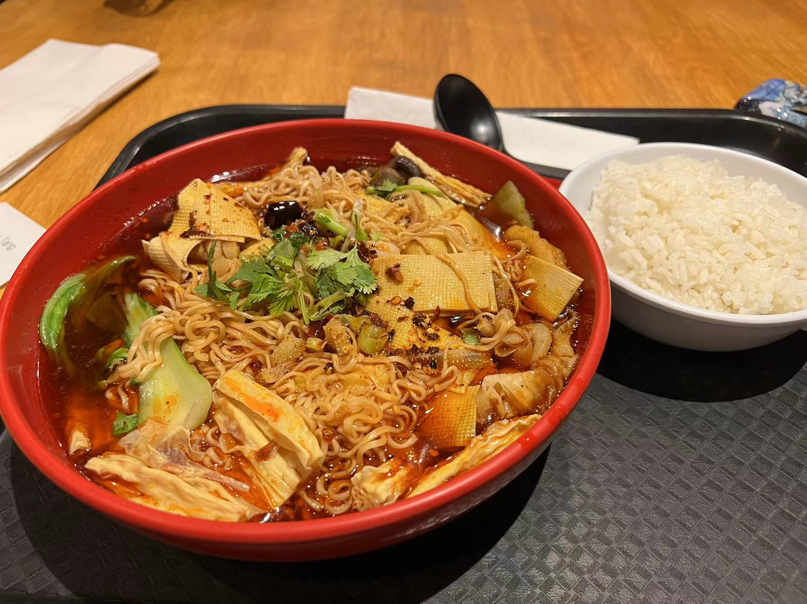

重庆川菜 EVO Cafe (绿街南，店如其名)

伊面园 (面食+西北风味，中午有米饭套餐)

东海渔村 (粤菜)

HotWok (CC旁边，快餐)

Panda Express (绿街上，快餐)

功夫茶 Kung Fu Tea (新开的亚洲餐厅，价格小贵)

Evo再往南E John Street上有家上海菜，在Insomnia Cookies旁边，忘了叫啥了

根据人均消费，我个人给出的价格梯队是

一梯队（20刀以上）：老四川，功夫茶、麻辣烫、晚上的EVO

二梯队（15-20刀）：蒲月巷、伊面园、东海渔村

三梯队（10-15刀）：麦香村、万家香

四梯队（10刀以下，快餐）：中午的EVO、HowWok、Panda Express

### 咖啡厅&奶茶店
图书馆一楼咖啡厅 Royal Espresso

ECE Building一楼咖啡厅Daily Byte

Illini（读音：yi lai nai，不是yi li ni） Union里Starbucks

绿街和S Wright Street交叉口Cocomero奶茶店

老虎堂Tiger Sugar

绿街北，麻辣烫对面 朝茶 TSAō·CHA

绿街上 Teamoji

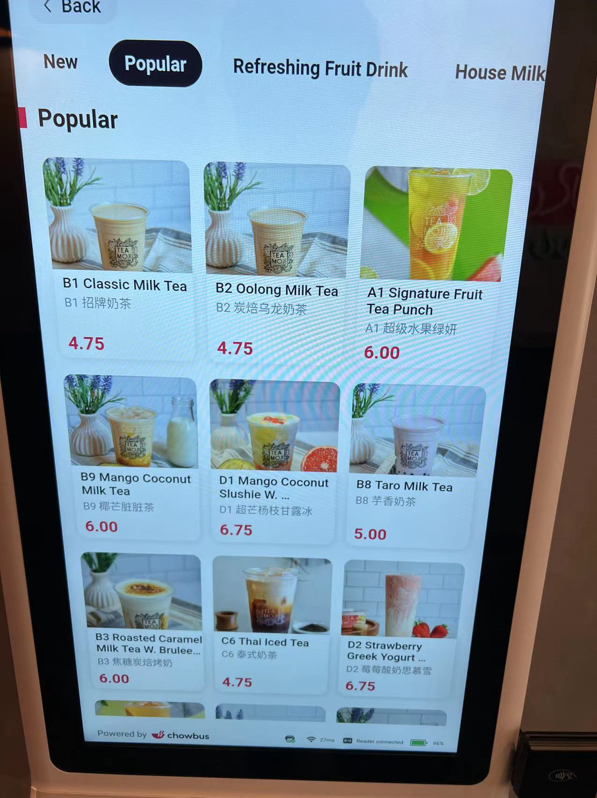
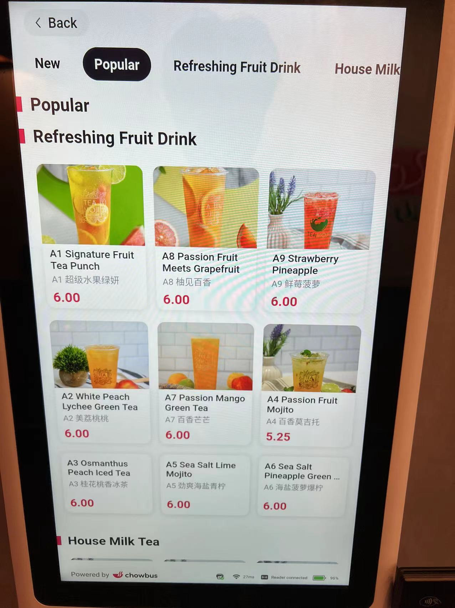
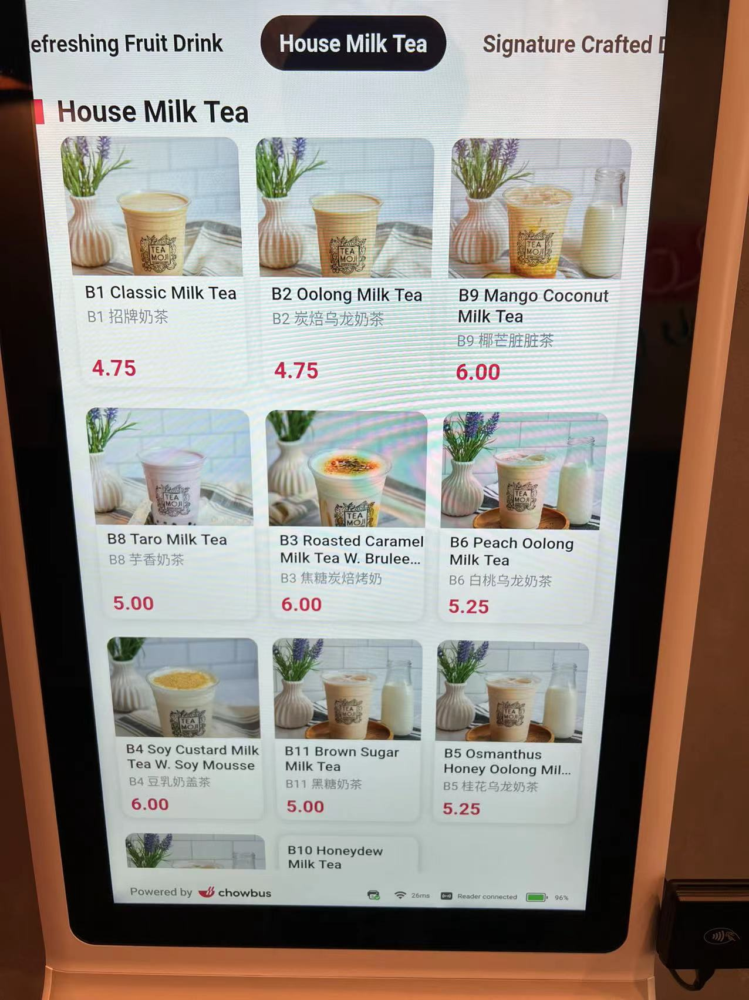
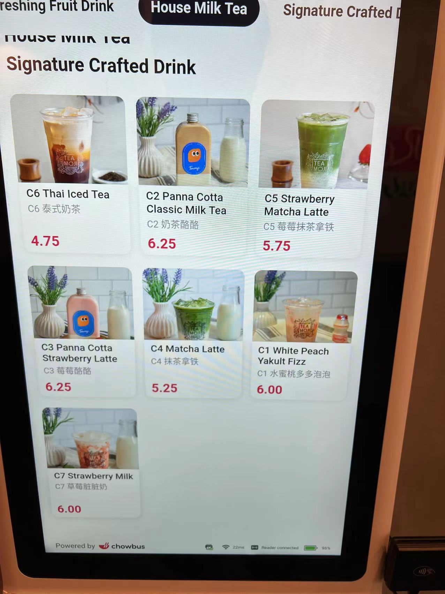
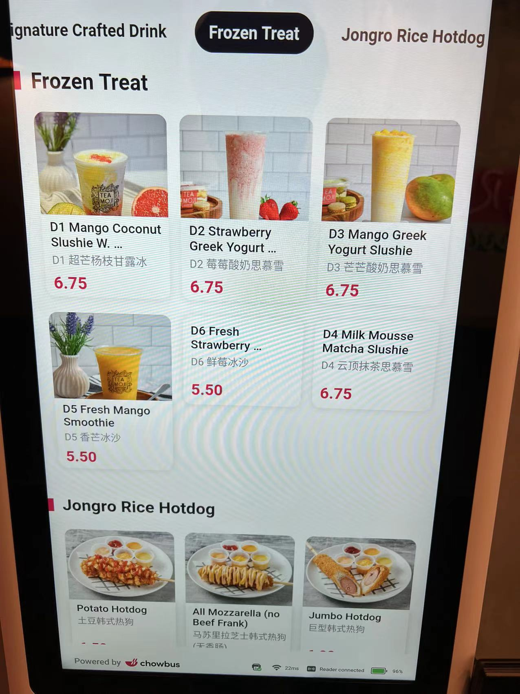
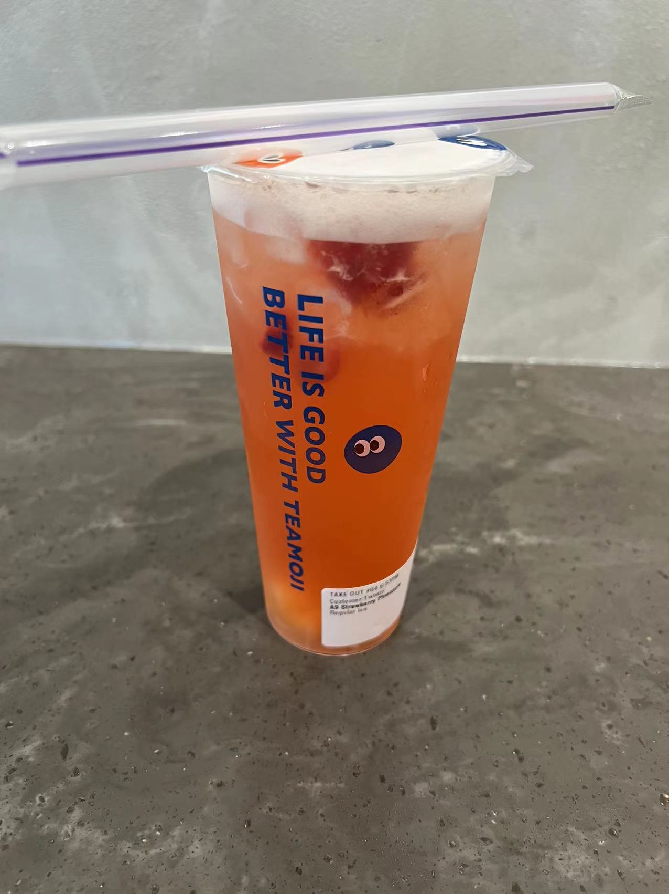

### 交通
Urbana-Champaign是有公交车的，并且校内范围公交车都是免费的，不需要出示学生卡或者巴士通票。如果住在Campus Circle附近，那么22S/22N/220S/220N几条连接Campus Circle和Illini Union（离绿街很近）的线路是不二之选。220和22线路上完全一样，只是白天叫22晚上叫220。

有一辆单车的话，去超市，教室，药店的时间都可以缩短一大半。UIUC附近有很多地方可以买到单车。最贵的在W University Ave上，叫 Durst Cycle，里面的单车都在1000美刀左右。稍微低一点价格的单车可以在沃尔玛买到，三四百刀左右。最便宜划算的是Campus Circle旁边的当铺，也就是一个二手商店，叫Pawn King，里面的单车都在一百刀左右。除了单车，Pawn King还有大量便宜实惠的二手商品，比如apple watch，显示器，电脑，吸尘器等等。值得注意的是，在香槟偷窃行为非常常见，因为学校旁边就是贫民区，所以一定要买一个好一点的锁（建议U型锁加锁链），把车架，前后车轮都拴好。

### 打印服务

### 购物
Urbana-Champaign西北Walmart

绿街上Target

Icon附近County Market

远东超市

Amazon

华夏超市

### 上课的地方

### 学习的好地方

### 课余活动

### J-1签证注意事项
一定要保证自己在修课程不低于12学分，否则会失去留学生身份被遣返！

J-1签证进行校内（包括TA）&校外工作都需要ISSS的批准，千万不要偷偷打黑工（同样遣返）！

ISSS: International Studetn and Scholar Services

https://isss.illinois.edu/

来之前把这个网站上"Students"部分都看一遍，用谷歌浏览器自带的翻译功能看一遍也行。

## 春假&秋假 USA 旅游攻略
Credit: [Reself Chai](https://github.com/Reself-C)  
https://reself-c.github.io/travelUSA  
Official Account(**subscribe!**): https://mp.weixin.qq.com/s/ZH58ftXI_6pu7ujAPe7gTw   

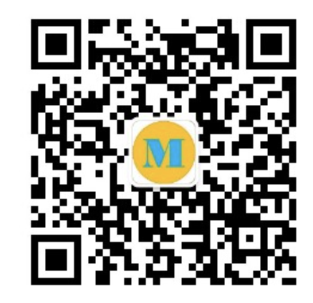

## 其他热议话题

### COVID-19

### Safety in USA

### Drive Cars

### Academic Integrity
https://github.com/Violet24K/UIUC-Academic-Integrity

千万不要触碰国外大学的红线！
ZJUI（以及大多数其他国内大学）学术诚信做的真不行，没有应有的执行和处罚力度。切记在UIUC如果坐实学术不端，作业合作真的会被降档，作业抄袭真的会给F，考试舞弊真的会被退学！

## gallery@UIUC

## 离开UIUC，漫漫回国路
希望5/6月就回国保研/直博的未来的硕士博士院士可以行行好帮俺填一下这里捏！(蹲)

没蹲到人，还是我自己填吧。

写这段文字的时候，我正在原定西雅图当地时间2022年9月13日晚上起飞，后来延误到9月14日早上起飞的、从西雅图经停首尔飞往上海的飞机上。我整个的回国安排基本是由我自己来完成的，也亲身经历了2022年9月一整个回国的过程，不得不说在国内疫情防控的层层加码之下，中美之间的旅行都非常的不方便，回国尤其是难上加难。希望能尽早恢复正常吧。

**2022年，我个人建议提前三个月着手准备回国事宜**。

### 美国直飞
目前回国要求必须是直飞，不得中转（下一个section香港路线属于是先到香港再从香港直飞内地）。目前美国境内只有六处直飞回国点：旧金山（美联航），洛杉矶（国航、厦航、南航），西雅图（达美航空），底特律（达美航空），达拉斯（美国航空），纽约（东方航空）。微博上有个航空博主“北美票帝”，会更新最新的航班信息。买票这里令人最头疼的就是中国民航局的熔断机制以及美国的熔断反制：当一趟航班落地后新冠检测阳性的乘客超过总人数的4%时，未来同样的航班回停运几个星期到两个月不等。具体多久要看阳性人数。达美航空是可以多交点钱买可退机票的，能够让计划更灵活，这也是我选择达美航空回国的主要原因。

买完票以后就是默默等到回国的日期了。2022年9月的政策是起飞前48小时+24小时双核酸，其中两次核酸检测必须相隔24小时以上。所以一般会提前三到四天从香槟出发。比如我9月13号的航班，我选择了9月10号赶一天路到西雅图，9月11和9月12双核酸。双核酸的政策不同大使馆要求的还不一样。准备的时候要看看大使馆官方的通告。底特律目前还要求在指定机构检测，西海岸应该已经放开了，只要有资质认证的检测机构都可以。北美票帝微博里有一个核酸检测机构的信息共享文档，可以看看之前回国的人的评价以及有没有什么注意事项啥的。我选择的是西雅图Atlas Genomics(https://atlas-genomics.com/),这个机构的服务还是挺不错的，工作人员说中文且会有微信群答疑。

双核酸检测完成后就可以向大使馆申请健康码和海关码了。两个码都是上飞机需要的，但海关码需要保证下飞机的时候还有效。海关码申请后有效期是24小时，所以基本就是在起飞前申请，下飞机还有效。

然后就是到机场办理值机和行李托运、过安检、找到登机口。如果航班不熔断且核酸不出问题的话，整个回国的过程其实相当丝滑。小红书上有很多关于回国的blog，挺有用的，从哪个城市回国直接搜索就行。

下飞机后，核酸检测、过海关、领行李、上车去隔离酒店。整个回国过程就算是结束了吧。

### 香港路线
跟美国直飞比起来，走香港的话会便宜很多，但需要在香港多隔离几天，且不能保证香港飞内地是顺利的。我真填不了。蹲个人填。

