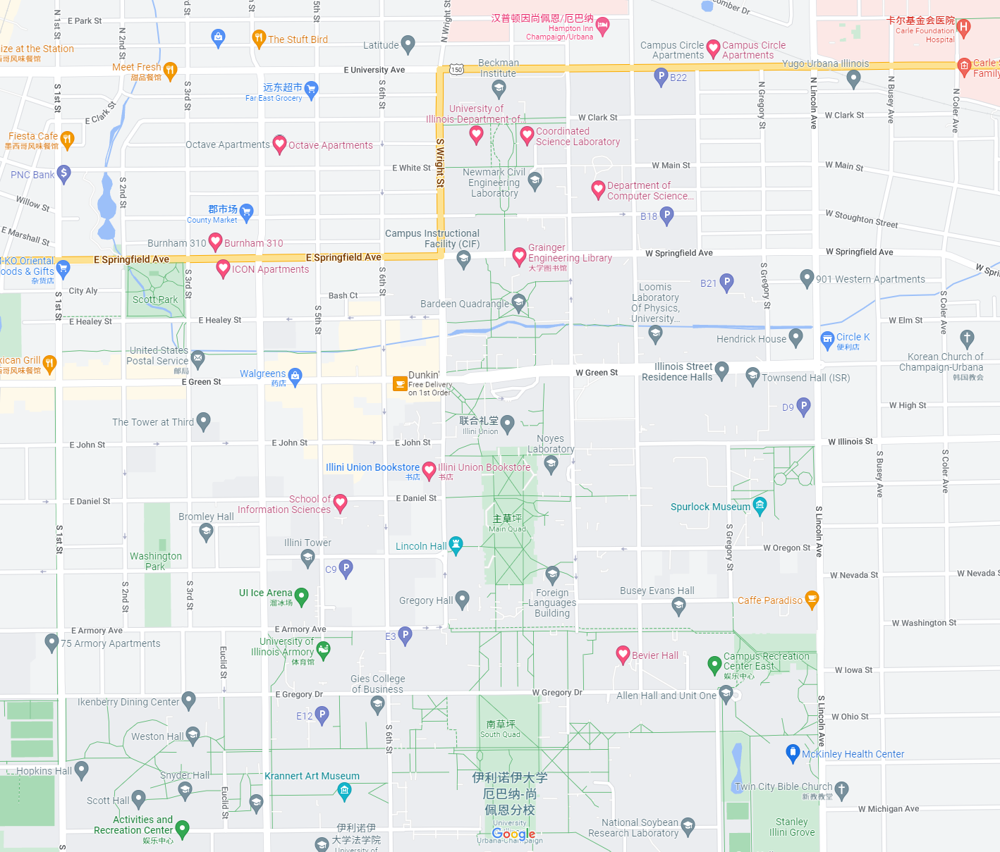
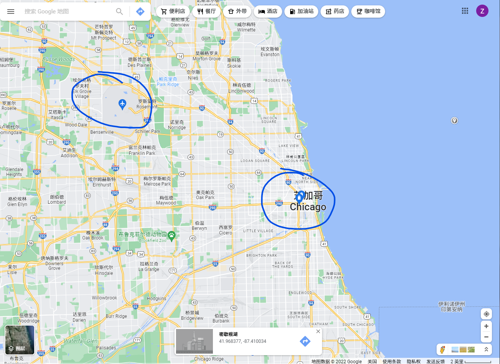

# UIUC生存指南  
ZJUI学生本科期间会在UIUC进行为期一到两学期的交换，但奈何学院刚刚诞生不久且在临行准备方面并不活跃（甚至有些摆烂，反而要求学生签订免责协议），并没有人指导在UIUC具体的生存办法。这让同学们在赴UIUC交换前一学期忙碌课业的同时忧心忡忡，或来了UIUC以后才发现准备有遗漏，且给了一些不懂装懂的第三方（如奚爸）发挥的舞台。  

我于2022年1月至2022年8月于UIUC交换学习，对整个交换过程（除回国）有一些亲身的体会，争取用闲暇时间记录在此，为今后ZJUI同学们赴UIUC交换提供参考。  

同时，我个人的经历毕竟有限，我也希望这能够成为一个由ZJUI社区参与开发并维护的开源项目，欢迎在UIUC有过交换经历的同学一起贡献~  

## 重要声明
本库没有收取任何赞助，所有推荐没有任何广告成分，一切想法仅供参考。本库贡献者们不为任何曾经正确但现在错误的信息负责（我们都有自己的学业和事业，有时候真的懒得维护）。

## How to contribute  
fork并添加自己的想法后提交pull request即可，我会时常关注本库。  

## UIUC地图（单击查看清晰大图）

大部分的活动范围会在Illini Union Bookstore以北，E University Ave以南，ICON Apartments以东， Campus Circle以西区域内。

## 来UIUC前  

### 机票 + 出发时注意事项   
可选航空公司（排名无先后）： [中国国际航空](https://www.airchina.com.cn/)，[美国联合航空](https://www.united.com/zh-hans/cn/)，[加拿大航空](https://www.aircanada.com/ca/zh/aco/home.html)，[中国南方航空](https://www.csair.com/cn/)，[汉莎航空](https://www.lufthansa.com/cn/zh/homepage)，[国泰航空](https://www.cathaypacific.com/cx/zh_HK.html)，[厦门航空](https://www.xiamenair.com/zh-cn/)  

2022年1月时，各大航空公司基本都需要临行前24小时的核酸检测阴性证明，可以到海宁市人民医院进行检测，上午检测下午（6小时到8小时左右）就能出结果。学校位置比较偏不好打车，建议提前约车。  

在预订机票时记得咨询航空公司相应航班是不是行李直挂（行李办理完托运直接到目的地，中转时不需要自己重新拿行李办托运手续）。建议选择行李直挂的航班（中转办托运据说需要2小时以上，请注意中转所需时间）。  

对于订票人数比较多的航班，可以询问学院能否统一安排车辆前往机场（我认为要求学院安排并不过分，毕竟是年级规模的交换）。一般的巴士行李区并不能容纳每个乘客两个行李箱，提醒学院计算位置时考虑行李区放不下的行李。 

准备行李时，一般会准备一个书包+两个行李箱（两大托运或一大托运一小登机）。国际航班的登机箱尺寸会比国内航班的尺寸小一点，笔者当时带的登机箱（国内的航班一直可以上飞机）在浦东机场因为太大被要求托运。  

香槟冬天温度可以达到-10摄氏度左右，夏季温度可以达到35摄氏度，可以针对抵达季节带衣服，来美国后再网购，不用把整个衣柜搬过来。  

在向行李箱中塞入药物或食物时，建议查一下是否允许入境。任何肉类食品都不要带，否则有遣返风险。药物比较玄学，含有敏感成分的药品尽量不要带，美国药房里发烧感冒头疼之类的非处方药物都可以购买。   

出发之前建议在电子设备以及行李箱上贴一些标识（贴纸），防止行李箱混淆。另外入境时会有安检（具体在“海关”部分说明），如果你的macbook和别人的都长一个样，那么过完x-ray就不知道哪台是谁的了（人和行李会分开检查）。

国际航空登机手续很麻烦，需要预留三小时以上的时间。大概流程是找值机柜台，办理托运，扫二维码填写出境健康声明，过边检，过安检，等飞机，登机。证件至少需要核酸检测证明、翻译后的新冠疫苗接种证明（具体在“疫苗”部分说明）、DS2019、护照。

大多中美航线的飞机上是有wifi的。电源的话，根据飞机型号的不同，可能需要转换器（有些飞机用的美国标准110V电压，我们220V电压充电的设备充电口会不太一样）。

最后滴最后，趁着还在国内，珍惜那些来了美国就见不到了的东西（如食堂一楼的红豆双皮奶）吧！

### 签证  

### 租房
20级学生大多已经租好，暂不开发

### 信用卡&消费准备&消费文化差异
美国消费方式还停留在pos机的阶段，并没有任何一家公司实现了诸如wx或zfb的移动支付“大一统”。  

来美国之前需要做的与消费有关的最重要的事情有：办理一张visa信用卡，以及到银行兑换一些美元现金。在美国的每一笔消费小票会告诉你交了多少税（Illinois一般11%左右），使用现金在餐厅支付不用交税。至于换多少现金的问题，我个人来美之前换了1000，从一月到五月大概花了不到200。基本都是用信用卡支付的。另外大多app（比如amazon，uber）都可以绑定信用卡消费。visa信用卡还款可以用美元也可以用人民币（不过汇率天天在变）。

visa信用卡有很多，我自己办理的是中国银行的子母卡，还款会比较方便（不过每一笔消费爹妈都会看到hhhh，也算是随时报平安）。而且考虑到其他银行在美国可能没有分行，如果信用卡遗失比较麻烦。大额消费有时会让输入PIN码，但我们往往不知道自己曾经设置过。格局打开，如果试了半天没试出来，不妨直接空着并点击next（空PIN也是PIN）。信用卡会有限额，这个要在出国之前设置好。请确保第一个月有5000刀的额度，以及接下来每个月有2500刀以上的额度。  

在餐厅吃饭时，如果服务生将菜给你端上来，你理应支付小费。一般在10%到20%。也有很多餐厅是做好吃的让你自己去取的，这种就不需要给小费。很多餐厅会要求顾客就餐完毕后将餐盘端到指定的地方后，或者将一次性餐盒扔到垃圾桶后再离开。  

很多超市（比如Target）会有自助收银。挑完要买的东西后可以去人工收银（可能要等待，且人工收银一般两个塑料袋装得下的东西给你装四个袋子），也可以选择自助。自助收银只需将每个商品的条形码扫一下，都扫完以后支付即可。扫重复了可以叫店员帮忙恢复一下。但我时常怀疑如果我少扫了或者扫错了也一样可以装进袋子拎走。  

美国满21岁才允许购买含酒精的饮品。如果需要购买酒类，需要带上护照或者其他出生年月证明。  

美国有些东西莫名其妙的贵，不过科技产品都相对便宜一点。国内4000块的显示屏400刀就能买到，但很多tb上九块九包邮的这边能收二十刀并且加收运费。比如Campus Circle隔壁自行车店那种国内2000rmb能买到的自行车要800刀，bookstore一个小鼠标垫卖19.9刀，非常离谱。来交换的话预计每月消费应该在房租800+饮食900+其他购物消费300 = 2000左右（单位：美元）。如果你是富二代请无视这个数字，花就完了。  

### 疫苗
这里疫苗主要是有两个目的：第一是登机时需要covid-19疫苗的接种证明翻译件，第二就是UIUC对于免疫接种的要求。

当时我去的地方是浙江国际旅行卫生保健中心，位于杭州文三路沈塘桥地铁站南200米左右。杭海城际还挺方便，挑了个周五当天去当天回的。  

材料的话，至少需要：  
1. （身份证+护照） 的 （原件+复印件）  
2. UIUC官网上下载的疫苗表。不需要提前填写。大概长这样：[immunization.pdf](file/Immunization%20History-601-with%20Upload-fillable.pdf)
3. 新冠疫苗的接种记录及复印件（海宁接种的话会有一个小纸条接种记录）
4. 小时候的疫苗接种本+复印件（这个不同地方的不一样）
5. financial support复印件
6. 2寸照片

另外就是，如果疫苗有货的话，可以补打一下UIUC要求的疫苗。国内大多数地方都差一到两针麻腮风以及百白破。当然也可以选择来UIUC白嫖医疗保险。具体会在“初到UIUC：TD Test + 接种疫苗”部分说明。

宁波也有一个可以办理国际卫生手续的地方。蹲一个宁波朋友填坑。

### 海关
就我自己过美国海关的经历而言，我感觉只要不碰这边的红线（别带不让带的，别说不该说的），问题都不大。

我当时是在加拿大温哥华转机的时候办理的入境。经过了二十小时的漫长飞行，下飞机后寻找USA方向的标示，抵达美国入境安检点。入境安检主要是检查是否带了一些允许出中国国境但是禁止入美国国境的东西。入境安检还是比较严格的，会要求倒掉水杯里的液体，将行李中的所有电子产品拿出来放到筐里，并把书包也放筐里，统一过X-ray。一般人是会比筐晚出安检的（这时候贴纸就很重要了，毕竟大家的电脑很多都长一个样子，说不定前面的人就把你的电脑错拿走了）。另外就是入境安检需要shoes off并放到另一个筐里。美国这个入境安检给我的感觉就是非常混乱。人很多但是通道很少，安检区占地面积也很小。我当时电子产品很多，electronic devices + bag + shoes总共好像用了四个筐才把东西全部放下，幸好并没有混淆。

至于直接在美国本土（旧金山可能比较多）入境，蹲一个朋友完善。

### Chicago->UIUC  
从芝加哥奥黑尔机场到香槟UIUC还有一段很漫长的距离，19级当时进行了包车（也方便放行李）。另外就是机场其实是有大巴直达香槟的，如果没有包车选项可以考虑一下。然鹅我并不知道大巴怎么预定，蹲一个有经验的同学完善一下这里。  
 
其他办法的话其实不太推荐了（毕竟要带着很多行李）。芝加哥的Union Station有火车可以到达香槟，另外就是一些公司会运营芝加哥到香槟的公交线路。具体线路可以在Google Map上搜索。机场到Union Station直线距离其实都已经有20公里了。具体可见下图。  

### 必备app

## 初到UIUC

### 手机卡

### 学生卡

### 银行卡

### 核酸检测

### 购买必需品

### 购买食材

### 做点吃的
https://github.com/Anduin2017/HowToCook  

### TD Test + 接种疫苗

## 活在UIUC（并且争取活得滋润）

### 餐厅

### 咖啡厅&奶茶店

### 交通

### 打印服务

### 购物

### 上课的地方

### 学习的好地方

### 课余活动

### J-1签证注意事项

## 春假&秋假 USA 旅游攻略

## 其他热议话题

### COVID-19

### Safety in USA

### Drive Cars

## gallery@UIUC

## 离开UIUC，漫漫回国路
还没经历，暂不开发。希望我能顺利活着回去。

